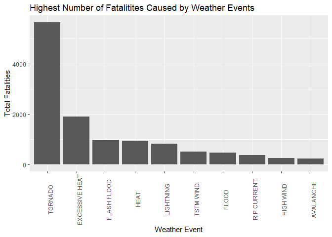
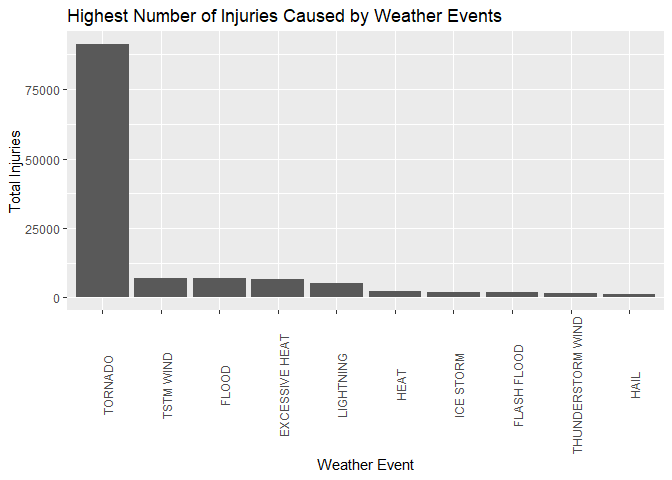
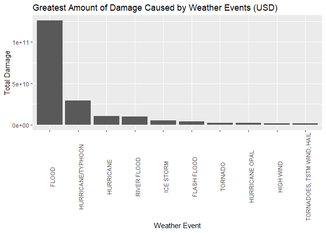

## Introduction

Extreme weather events can have great socio-economic impact. They can cause injuries, fatalities, property damage and further damage to crops and livestock. All this can have knock-on effects for the communitities that are affect. The National Oceanic and Atmospheric Administration's storm database keeps a track of the various weather events and their impact. This report discusses some brief analysis that was done to determine which of these weather events has the greatest effect on population health and causes the most damage. 

## Reading in the Data

Before any detailed analysis can be done, the data to be analysed must be read into the R environment. R can check whether or not the data exists and download it if necessary. The .csv file should then be extracted and read into R.


```r
# Load the URL and filenames for the dataset
data_URL <- "https://d396qusza40orc.cloudfront.net/repdata%2Fdata%2FStormData.csv.bz2"
data_file <- "repdata_data_StormData.csv.bz2"

# check if the file exists. If not, download and unzip it
if (!file.exists(data_file)) {
    download.file(data_URL, data_file)
}

# Read the data into R
StormData <- read.csv(data_file)
```

## Data Processing
Now that the data is downloaded and saved, it can be processed for further analysis, and be used to investigate the various impacts of weather events. It is noted that, for this analysis, the dplyr and ggplot2 libraries will be necessary. These will therefore be loaded now.

```r
library(dplyr)
```

```
## Warning: package 'dplyr' was built under R version 3.5.1
```

```
## 
## Attaching package: 'dplyr'
```

```
## The following objects are masked from 'package:stats':
## 
##     filter, lag
```

```
## The following objects are masked from 'package:base':
## 
##     intersect, setdiff, setequal, union
```

```r
library(ggplot2)
```

```
## Warning: package 'ggplot2' was built under R version 3.5.1
```

# Impact on Population Health
In order to assess the impact of weather events on population health, the total number of fatalities and injuries caused by these events will be assessed. The code used to perform these checks is given below:


```r
# First subset the fatalities data
fatal_data <- subset(StormData, !StormData$FATALITIES == 0, select = (c(EVTYPE, FATALITIES)))

# Now calculate the total fatalities for each event type and list the top ten
fatal_totals <- aggregate(fatal_data$FATALITIES, by = list(fatal_data$EVTYPE), sum)
colnames(fatal_totals) <- c("Event_Type", "Total_Fatalities")
fatal_totals <- arrange(fatal_totals, desc(fatal_totals$Total_Fatalities))
```

```
## Warning: package 'bindrcpp' was built under R version 3.5.1
```

```r
head(fatal_totals, 10)
```

```
##        Event_Type Total_Fatalities
## 1         TORNADO             5633
## 2  EXCESSIVE HEAT             1903
## 3     FLASH FLOOD              978
## 4            HEAT              937
## 5       LIGHTNING              816
## 6       TSTM WIND              504
## 7           FLOOD              470
## 8     RIP CURRENT              368
## 9       HIGH WIND              248
## 10      AVALANCHE              224
```


```r
# First subset the injuries data
injury_data <- subset(StormData, !StormData$INJURIES == 0, select = (c(EVTYPE, INJURIES)))

# Now calculate the total injuries for each event type and list the top ten
injury_totals <- aggregate(injury_data$INJURIES, by = list(injury_data$EVTYPE), sum)
colnames(injury_totals) <- c("Event_Type", "Total_Injuries")
injury_totals <- arrange(injury_totals, desc(injury_totals$Total_Injuries))
head(injury_totals, 10)
```

```
##           Event_Type Total_Injuries
## 1            TORNADO          91346
## 2          TSTM WIND           6957
## 3              FLOOD           6789
## 4     EXCESSIVE HEAT           6525
## 5          LIGHTNING           5230
## 6               HEAT           2100
## 7          ICE STORM           1975
## 8        FLASH FLOOD           1777
## 9  THUNDERSTORM WIND           1488
## 10              HAIL           1361
```

# Economic Consequences
In order to assess the econonic impact of weather event, it is necessary to look at the damage that is cased. This is indicated by both property damage and crop damage in the given data set. It should be noted that the damge multiplers, which are given as characters in the dataset, must be replaced with the values the represent. For more information regarding the representation of these characters, please follow this [link](https://rstudio-pubs-static.s3.amazonaws.com/58957_37b6723ee52b455990e149edde45e5b6.html).

The code used to perform these checks is given below:


```r
# First subset the data on propery and crop damage
damage_data <- subset(StormData, !StormData$PROPDMG == 0 & !StormData$CROPDMG == 0, 
                      select = c(EVTYPE, PROPDMG, PROPDMGEXP, CROPDMG, CROPDMGEXP))

# Replace the multiplier symbols for the damage values with the actual multiplier values so that
# the correct damage values can be calculated
dmg_symbols <- levels(damage_data$PROPDMGEXP)
dmg_symbols <- sort(dmg_symbols)
dmg_multiplier <- c(0,0,0,1,10,10,10,10,10,10,10,10,10,1e+09,1e+02,1e+02,1e+03,1e+06,1e+06)
damage_multiplier <- data.frame(dmg_multiplier, dmg_symbols)
# Add a column for the property damage multiplier
damage_data$PROP_MULT <- damage_multiplier$dmg_multiplier[match(damage_data$PROPDMGEXP,
                                                                damage_multiplier$dmg_symbols)]
# Add a column for the crop damage multiplier
damage_data$CROP_MULT <- damage_multiplier$dmg_multiplier[match(damage_data$CROPDMGEXP,
                                                                damage_multiplier$dmg_symbols)]
damage_data$TOTAL_DMG <- (damage_data$PROPDMG * damage_data$PROP_MULT) + 
  (damage_data$CROPDMG * damage_data$CROP_MULT)

# Now calculate the total damage, including property and crop damage, for each weather event
damage_totals <- aggregate(damage_data$TOTAL_DMG, by = list(damage_data$EVTYPE), sum)
colnames(damage_totals) <- c("Event_Type", "Damage")
damage_totals <- damage_totals[order(damage_totals$Damage, decreasing = TRUE),][,]
head(damage_totals, 10)
```

```
##                    Event_Type       Damage
## 14                      FLOOD 126044533500
## 47          HURRICANE/TYPHOON  29348117800
## 42                  HURRICANE  10498188000
## 52                RIVER FLOOD  10108369000
## 49                  ICE STORM   5108618000
## 10                FLASH FLOOD   4309271894
## 74                    TORNADO   2385939080
## 45             HURRICANE OPAL   2187000000
## 38                  HIGH WIND   1918571300
## 76 TORNADOES, TSTM WIND, HAIL   1602500000
```

## Results
The results produced by the above analyses are shown below in graphical format.

# Impact on Popluation Health
The code used to plot the graphs for fatalities and injuries is given below:

```r
fatal_plot <- ggplot(fatal_totals[1:10,], aes(x = reorder(Event_Type, -Total_Fatalities), y = Total_Fatalities)) + geom_bar(stat = "identity") + theme(axis.text.x = element_text(angle = 90)) + ggtitle("Highest Number of Fatalitites Caused by Weather Events") + labs(x = "Weather Event", y = "Total Fatalities")
plot(fatal_plot)
```

<!-- -->

```r
injury_plot <- ggplot(injury_totals[1:10,], aes(x = reorder(Event_Type, -Total_Injuries), y = Total_Injuries)) + geom_bar(stat = "identity") + theme(axis.text.x = element_text(angle = 90)) + ggtitle("Highest Number of Injuries Caused by Weather Events") + labs(x = "Weather Event", y = "Total Injuries")
plot(injury_plot)
```

<!-- -->

The above plots show that the highest number of both fatalities and injuries are caused by a tornado weather event.

# Economic Consequences
The code used to plot the graphs for damages is given below:

```r
damage_plot <- ggplot(damage_totals[1:10,], aes(x = reorder(Event_Type, -Damage), y = Damage)) + geom_bar(stat = "identity") + theme(axis.text.x = element_text(angle = 90)) + ggtitle("Greatest Amount of Damage Caused by Weather Events (USD)") + labs(x = "Weather Event", y = "Total Damage")
plot(damage_plot)
```

<!-- -->

The above plot shows that the greatest amount of damage is cause by floods.
